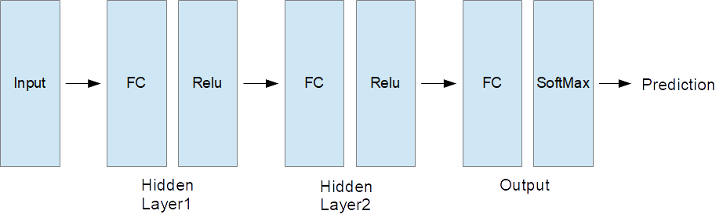

# Neural Network from scratch

This repo implements a neural network from scratch. The goal is to have a clean
implementation for learning, not a real-world performance optimized
implementation.

You can read some background in
[c231n (Stanford Univ.)](http://cs231n.github.io/). Details of the
backpropagation algorithm are described in
[Neural Networks and Deep Learning](http://neuralnetworksanddeeplearning.com/chap2.html).

## Preparing data

- Download [MNIST dataset](http://yann.lecun.com/exdb/mnist/) (4 files) and
  store those files into the "data" directory.
- Required file names are following:
  - train-images-idx3-ubyte.gz
  - train-labels-idx1-ubyte.gz
  - t10k-images-idx3-ubyte.gz
  - t10k-labels-idx1-ubyte.gz

## What can it do?

This is a neural network for the digit recognition (MNIST Dataset). The network
structure is shown in the following figure.



## Usage

Install all dependencies and then run:

```bash
python train.py
```

To simplify the execution, hyper parameters of the network have already been
pre-defined in the code.

Notes:

- All the digits data including the test data are normalized by 255.
- Split original training dataset into train & validation data.
  - training : validation = 0.8 : 0.2
- Keep training until the validation loss reaches to plateau.
  - Save weights and biases as ".npz" format only in case the validation loss
    improved.
- Load best model and evaluate model using test dataset.
